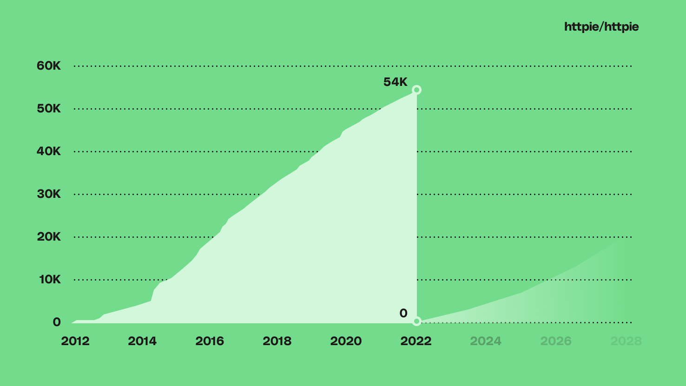

<br/>
<a href="https://httpie.io" target="blank_">
    
</a>
<br/>

# HTTPie: API çağı için kullanıcı dostu CLI HTTP istemcisi

HTTPie (telaffuzu _ˈeɪtʃ-ˈtiː-ˈtiː-ˈpaɪ_) Komut satırı araüzünde çalışan bir HTTP istemcisidir.
HTTPie, terminal ve web servisleri etkileşimlerini mümkün olduğu kadar kullanıcı dostu yapmayı hedefler.
HTTPie, APIler ve HTTP sunucuları arasında test, hata ayıklama ve genel etkileşimler gibi operasyonları gerçekleştirmek için tasarlanmıştır.
`http` ve `https` komutları keyfi HTTP istekleri oluşturmaya ve göndermeye olanak sağlar.
Basit ve doğal bir yazım biçimi kullanır, düzenli ve renklendirilmiş bir çıktı sunar.

[](https://httpie.org/docs)
[](https://pypi.python.org/pypi/httpie)
[](https://github.com/httpie/httpie/actions)
[](https://codecov.io/gh/httpie/httpie)
[](https://twitter.com/httpie)
[](https://httpie.io/discord)


## 54k GitHub yıldızı kaybettik

Bilmenizi isteriz ki yakın zamanda kazara bu repoyu özel moda ayarladık ve GitHub, toplanması onca yıl süren topluluğumuzu kaldırdı. Bütün hikayeyi buradan okuyabilirsiniz: https://httpie.io/blog/stardust




## Başlarken

- [Kurulum yönergeleri →](https://httpie.io/docs#installation)
- [Bütün dökümantasyon →](https://httpie.io/docs)

## Özellikler

- Anlamlı ve sezgisel yazım biçimi
- Biçimlendirilmiş ve renklendirilmiş terminal çıktıları
- Dahili JSON desteği
- Formlar ve dosya yüklemeler
- HTTPS, proxyler, ve yetkilendirme
- Keyfi veri istekleri
- Özel başlıklar
- Israrlı oturumlar
- `wget` benzeri indirmeler

[Tüm özelliklere göz at →](https://httpie.io/docs)

## Örnekler

Hello World:

```bash
$ https httpie.io/hello
```

Özel [HTTP metodları](https://httpie.io/docs#http-method), [HTTP başlıkları](https://httpie.io/docs#http-headers) ve [JSON](https://httpie.io/docs#json) verileri:

```bash
$ http PUT pie.dev/put X-API-Token:123 name=John
```

[Çevrimdışı modu](https://httpie.io/docs#offline-mode) kullanarak göndermeksizin bir istek oluşturma ve yazdırma:

```bash
$ http --offline pie.dev/post hello=offline
```

[GitHub API](https://developer.github.com/v3/issues/comments/#create-a-comment)'yi [Issue](https://github.com/httpie/httpie/issues/83) sekmesinde [yetkilendirme](https://httpie.io/docs#authentication) ile yorum paylaşmak için kullanma:

```bash
$ http -a USERNAME POST https://api.github.com/repos/httpie/httpie/issues/83/comments body='HTTPie mükemmel! <3 :kalp:'
```

[Daha fazla örneklere göz atın →](https://httpie.io/docs#examples)

## Topluluk ve Destek

- [HTTPie veb sitesini](https://httpie.io) bütün dökümantasyon ve faydalı bağlantılar için ziyaret et.
- Sorular sormak, yeni özellikler tartışmak ve genel API sohbetleri için [Discord sunuzumuza katıl](https://httpie.io/discord)
- Twitter'da [@httpie](https://twitter.com/httpie)'a tivit at.
- [StackOverflow](https://stackoverflow.com/questions/tagged/httpie)'u sorular sormak için kullan  (`httpie` etiketini dahil et).
- [GitHub Issues](https://github.com/httpie/httpie/issues) sekmesinde hatalar ve yeni özellik talepleri için 'issue' oluştur.
- Tesadüfi gelişmeler için [HTTPie aboneliğine](https://httpie.io) abone ol.

## Katkıda bulunma

Var olan [problemlere](https://github.com/httpie/httpie/issues) bak ve yardım edebileceğin konuda [Pull Requests](https://github.com/httpie/httpie/pulls) oluştur. Eğer yeni bir özellik talep ederseniz veya bir hata bildirmek isterseniz, lütfen sağlanan taslaklardan bir ['GitHub Issue' oluşturun](https://github.com/httpie/httpie/issues).

[Katkıda bulunma rehberine göz atın →](https://github.com/httpie/httpie/blob/master/CONTRIBUTING.md)
